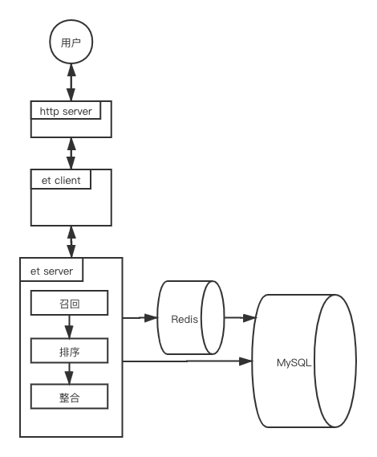
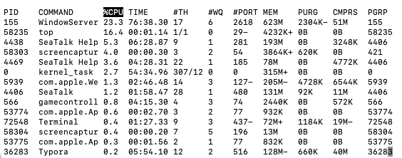
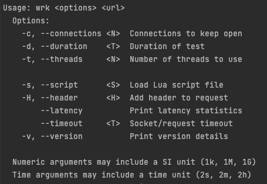
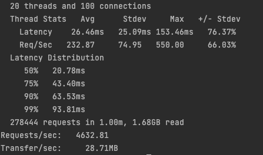
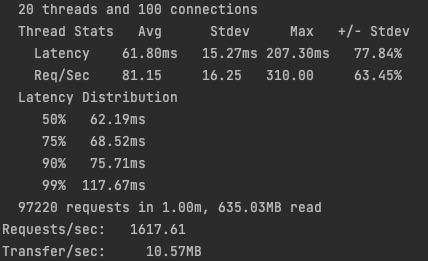
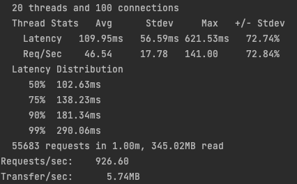
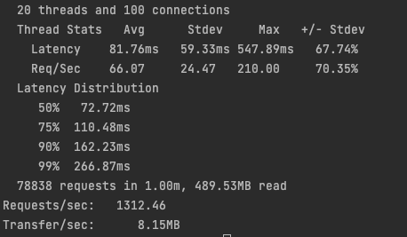
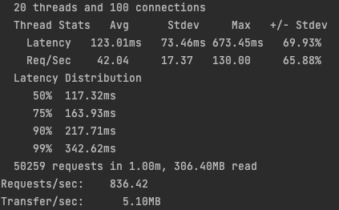

# EntryTask方案

## 一、 背景及目的

### 背景

新人入职，设计一个简单的搜索推荐系统。系统的功能主要包括分析数据，产生一个子集作为推荐结果。基于RPC实现一个完整的推荐服务。

### 目的

* 让团队更好地了解新人对技能的掌握情况
* 熟悉整个推荐系统的整体流程及基本数据流
* 熟悉搜索推荐相关的常用在线/离线存储引擎及读写方式
* 熟悉使用在线RPC框架来实现基本的在线服务
* 熟悉基本的推荐算法原理及实现
* 熟悉点击率预估的基本模型训练和在线预估（可选，加分项）
* 熟悉在线服务的压测及高可用服务实现（可选，加分项）

## 二、逻辑架构设计



## 三、接口设计

### http接口

访问接口：127.0.0.1:81/getBestStoresList?

| 参数      | 意义                                        |
| :-------- | :------------------------------------------ |
| userId    | 用户id(暂未使用)                            |
| longitude | 用户经度                                    |
| latitude  | 用户纬度                                    |
| listNum   | 返回结果个数                                |
| method    | 召回方式（1：按距离，2:按销量，3:混合方式） |

示例：

`http://127.0.0.1:81/getBestStoresList?longitude=106&latitude=-6&listNum=222&method=3`

### 请求参数

#### OutletRequest

| 参数    | 类型     | 意义                                        |
| ------- | -------- | :------------------------------------------ |
| userId  | int64    | 用户id                                      |
| pos     | Position | 用户位置                                    |
| listNum | int32    | 返回结果数目                                |
| method  | int32    | 召回方式（1：按距离，2:按销量，3:混合方式） |

#### Position

| 参数      | 类型   | 意义     |
| --------- | ------ | -------- |
| longitude | double | 用户经度 |
| latitude  | double | 用户纬度 |

### 返回参数

#### OutletResponse

| 参数    | 类型                | 意义                      |
| ------- | ------------------- | ------------------------- |
| code    | int32               | 状态码（0：成功，1:失败） |
| listNum | int32               | 返回结果数目              |
| list    | repeated RetMessage | 返回结果列表              |

#### RetMessage

| 参数      | 类型   | 意义           |
| --------- | ------ | -------------- |
| distance  | string | 距离用户的距离 |
| logoURL   | string | 门店URL        |
| name      | string | 门店名称       |
| address   | string | 门店地址       |
| itemsSold | string | 门店销量       |

### 完整的单词请求示例

http请求：

`http://127.0.0.1:81/getBestStoresList?longitude=106&latitude=-6&listNum=20&method=3`

返回结果：

```json
{
    "list": [
        {
            "distance": "0.756900km",
            "logoURL": "https://cf.shopee.co.id/file/fed01831088875194eb42165d448507d",
            "name": "Alfamart Samang Raya Anyer",
            "address": "LINK.PINTU AIR RT.04/04 KEL. SAMANGRAYA KEC. CITANGKIL",
            "itemsSold": "7938222"
        },
        {
            "distance": "1.262100km",
            "logoURL": "https://cf.shopee.co.id/file/fed01831088875194eb42165d448507d",
            "name": "Alfamart Samang Raya",
            "address": "JALAN RAYA ANYER RT 002 RW 004 KEL. SAMANG RAYA KEC. CIWANDAN",
            "itemsSold": "7938222"
        },
        {
            "distance": "1.529600km",
            "logoURL": "https://cf.shopee.co.id/file/fed01831088875194eb42165d448507d",
            "name": "Alfamart Anyer",
            "address": "JL. RAYA ANYER NO.56 KEL. TEGAL RATU KEC. CIWANDAN",
            "itemsSold": "7938222"
        },
        {
            "distance": "2.010100km",
            "logoURL": "https://cf.shopee.co.id/file/fed01831088875194eb42165d448507d",
            "name": "Alfamart Pabuaran Samsat",
            "address": "JL.RAYA MERAK KM.3 LINK PABUAR KEL. RAWA ARUM KEC. GROGOL PULOMERAK",
            "itemsSold": "7938222"
        },
        {
            "distance": "2.218900km",
            "logoURL": "https://cf.shopee.co.id/file/fed01831088875194eb42165d448507d",
            "name": "Alfamart SP Ciriu 2",
            "address": "LINK. CIRIU RT. 001 RW. 006 KEL. SAMANGRAYA KEC. CITANGKIL",
            "itemsSold": "7938222"
        },
        {
            "distance": "2.419900km",
            "logoURL": "https://cf.shopee.co.id/file/fed01831088875194eb42165d448507d",
            "name": "Alfamart Raya Merak",
            "address": "RAYA MERAK LINK TEGAL WANGI KP BARU RT02/01 KEL. RAWA ARUM KEC. GROGOL PULOMERAK",
            "itemsSold": "7938222"
        },
        {
            "distance": "2.923900km",
            "logoURL": "https://cf.shopee.co.id/file/fed01831088875194eb42165d448507d",
            "name": "Alfamart Ramanuju Cilegon",
            "address": "JL.RAYA ANYER NO.5-6 KEL. RAMANUJU KEC. PURWAKARTA",
            "itemsSold": "7938222"
        },
        {
            "distance": "2.937700km",
            "logoURL": "https://cf.shopee.co.id/file/fed01831088875194eb42165d448507d",
            "name": "Alfamart Warnasari",
            "address": "JALAN SUNAN AMPEL TAMAN WARNASARI INDAH RKB 1 NO 4\u0026 5 RT 01 RW 04 KEL. WARNASARI KEC. CITANGKIL",
            "itemsSold": "7938222"
        },
        {
            "distance": "2.944400km",
            "logoURL": "https://cf.shopee.co.id/file/fed01831088875194eb42165d448507d",
            "name": "Alfamart Ciwandan",
            "address": "JL.RAYA ANYER NO.27, RT.13, RW.06 KEL. TEGAL BATU KEC. CIWANDAN",
            "itemsSold": "7938222"
        },
        {
            "distance": "3.194600km",
            "logoURL": "https://cf.shopee.co.id/file/fed01831088875194eb42165d448507d",
            "name": "Alfamart Perum Arga Baja",
            "address": "JL. ARGA RAYA BLOK D9 NO.14 RT 013 RW 04 KEL. KOTASARI KEC. GROGOL PULO MERAK",
            "itemsSold": "7938222"
        }
    ],
    "listNum": 10,
    "status": "success"
}
```

##  四、压测

### 压测环境：

#### 设备：


#### 进程占用情况：



#### 压测软件

Wrk



### 单用户压测：

#### 按距离

`wrk -t 12 -c 100 -d 60 --latency "http://127.0.0.1:81/getBestStoresList?longitude=106&latitude=-6&listNum=20&method=1"`



20个线程，100个并发数条件下QPS为4632.81，P99在93.81ms左右。


#### 按销量

`wrk -t 12 -c 100 -d 60 --latency "http://127.0.0.1:81/getBestStoresList?longitude=106&latitude=-6&listNum=20&method=2"`




20个线程，100个并发数条件下QPS为1617.61，P99在117.67ms左右。


#### 距离与销量混合方式

`wrk -t 12 -c 100 -d 60 --latency "http://127.0.0.1:81/getBestStoresList?longitude=106&latitude=-6&listNum=20&method=3"`



20个线程，100个并发数条件下QPS为926.60，P99在290.06ms左右。


### 多用户压测

#### 按距离

```lua
wrk.method="GET"

local queries = {
    "/getBestStoresList?longitude=106&latitude=-6&listNum=20&method=1",
   "/getBestStoresList?longitude=110&latitude=6&listNum=20&method=1",
   "/getBestStoresList?longitude=106&latitude=-8&listNum=10&method=1",
   "/getBestStoresList?longitude=106&latitude=-7&listNum=20&method=1",
   "/getBestStoresList?longitude=106&latitude=-6&listNum=30&method=1",
   "/getBestStoresList?longitude=106&latitude=-6&listNum=10&method=1",
   "/getBestStoresList?longitude=106&latitude=-4&listNum=20&method=1",
   "/getBestStoresList?longitude=200&latitude=-6&listNum=20&method=1",
   "/getBestStoresList?longitude=106&latitude=-1&listNum=20&method=1",
   "/getBestStoresList?longitude=106&latitude=0&listNum=20&method=1",
   "/getBestStoresList?longitude=106&latitude=-6&listNum=30&method=1",
   "/getBestStoresList?longitude=106&latitude=-6&listNum=10&method=1",
   "/getBestStoresList?longitude=106&latitude=-6&listNum=20&method=1",
   "/getBestStoresList?longitude=106&latitude=-8&listNum=20&method=1",
}

local i = 0

request = function()
    local path = wrk.format(nil, queries[i % #queries + 1])
    i = i + 1
    return path
end
```

`wrk -t 20 -c 100 -d 60 -s request_distance.lua --latency "http://127.0.0.1:81"`


20个线程，100个并发数条件下QPS为4581.31，P99在94.18ms左右。

#### 按销量

```lua
wrk.method="GET"

local queries = {
    "/getBestStoresList?longitude=106&latitude=-6&listNum=20&method=2",
   "/getBestStoresList?longitude=110&latitude=6&listNum=20&method=2",
   "/getBestStoresList?longitude=106&latitude=-8&listNum=10&method=2",
   "/getBestStoresList?longitude=106&latitude=-7&listNum=20&method=2",
   "/getBestStoresList?longitude=106&latitude=-6&listNum=30&method=2",
   "/getBestStoresList?longitude=106&latitude=-6&listNum=10&method=2",
   "/getBestStoresList?longitude=106&latitude=-4&listNum=20&method=2",
   "/getBestStoresList?longitude=200&latitude=-6&listNum=20&method=2",
   "/getBestStoresList?longitude=106&latitude=-1&listNum=20&method=2",
   "/getBestStoresList?longitude=106&latitude=0&listNum=20&method=2",
   "/getBestStoresList?longitude=106&latitude=-6&listNum=30&method=2",
   "/getBestStoresList?longitude=106&latitude=-6&listNum=10&method=2",
   "/getBestStoresList?longitude=106&latitude=-6&listNum=20&method=2",
   "/getBestStoresList?longitude=106&latitude=-8&listNum=20&method=2",
}

local i = 0

request = function()
    local path = wrk.format(nil, queries[i % #queries + 1])
    i = i + 1
    return path
end
```

`wrk -t 20 -c 100 -d 60 -s request_itemsSold.lua --latency "http://127.0.0.1:81"`



20个线程，100个并发数条件下QPS为1312.46，P99在266.87ms左右。


#### 距离和销量混合方式

```lua
wrk.method="GET"

local queries = {
    "/getBestStoresList?longitude=106&latitude=-6&listNum=20&method=3",
   "/getBestStoresList?longitude=110&latitude=6&listNum=20&method=3",
   "/getBestStoresList?longitude=106&latitude=-8&listNum=10&method=3",
   "/getBestStoresList?longitude=106&latitude=-7&listNum=20&method=3",
   "/getBestStoresList?longitude=106&latitude=-6&listNum=30&method=3",
   "/getBestStoresList?longitude=106&latitude=-6&listNum=10&method=3",
   "/getBestStoresList?longitude=106&latitude=-4&listNum=20&method=3",
   "/getBestStoresList?longitude=200&latitude=-6&listNum=20&method=3",
   "/getBestStoresList?longitude=106&latitude=-1&listNum=20&method=3",
   "/getBestStoresList?longitude=106&latitude=0&listNum=20&method=3",
   "/getBestStoresList?longitude=106&latitude=-6&listNum=30&method=3",
   "/getBestStoresList?longitude=106&latitude=-6&listNum=10&method=3",
   "/getBestStoresList?longitude=106&latitude=-6&listNum=20&method=3",
   "/getBestStoresList?longitude=106&latitude=-8&listNum=20&method=3",
}

local i = 0

request = function()
    local path = wrk.format(nil, queries[i % #queries + 1])
    i = i + 1
    return path
end
```

`wrk -t 20 -c 100 -d 60 -s request_mixed.lua --latency "http://127.0.0.1:81"`



20个线程，100个并发数条件下QPS为836.42，P99在342.62ms左右。


### 压测总结

单用户压测与多用户压测结果相近，均是按距离召回的QPS最高，按混合方式的QPS最低。

对于三种召回方式而言，其中的按距离召回的QPS最高，按混合方式召回的QPS最低。

原因分析：

当按照距离召回时，系统中设定的距离半径为5km，最多返回500个门店，在这个范围内一般获得的门店数量远低于500，所以结果中门店规模小，之后的遍历操作耗时相对较小，使得单次请求的总耗时较小，QPS较高。在这种召回方式中，较为耗时的就是`func (c cmdable) GeoRadius(...)`函数（因为Redis是单线程，无法发挥多线程的优势），本系统选择设置3个Redis实例存储同样的数据来降低Redis单线程的瓶颈。

当按照销量召回时，系统设定的召回数目为500，因为数据库中数量为八万多，所以一定会返回500个门店，所以结果中门店规模相对按距离召回大，之后的遍历操作更耗时，所以单次的请求耗时较大，QPS较低。

混合方式首先按照距离召回获得列表1，接着按照销量召回获得列表2，然后合并列表1，2，自然相对于前两种方式更耗时，但是这种方式我认为也相对更合理。


## 五、总结

1. 系统选择在服务器启动时，直接把所有门店用map保存，key为门店id，为了保证map中数据与数据库中的一致性，选择定时任务，在每天的凌晨2.30从数据库中拉出所有门店数据更新map。et系统刚开始选择所有数据从MySQL或者Redis获取，当从MySQL获取时，尽管已经对门店id构建索引，但是取值操作依旧十分耗时，QPS只有130左右。当从Redis中去数据时，按理说应当很快，但是复杂数据结构在Redis中存取时，需要序列化和反序列化操作，这一步骤也非常耗时，成为QPS提高的瓶颈。

2. 最初只使用一个Redis示例进行按距离召回，Redis的单线程特性成为系统性能瓶颈，通过构建多个Redis示例存储同样的数据，当请求到来时，均匀分配给多个Redis，降低了该瓶颈。


